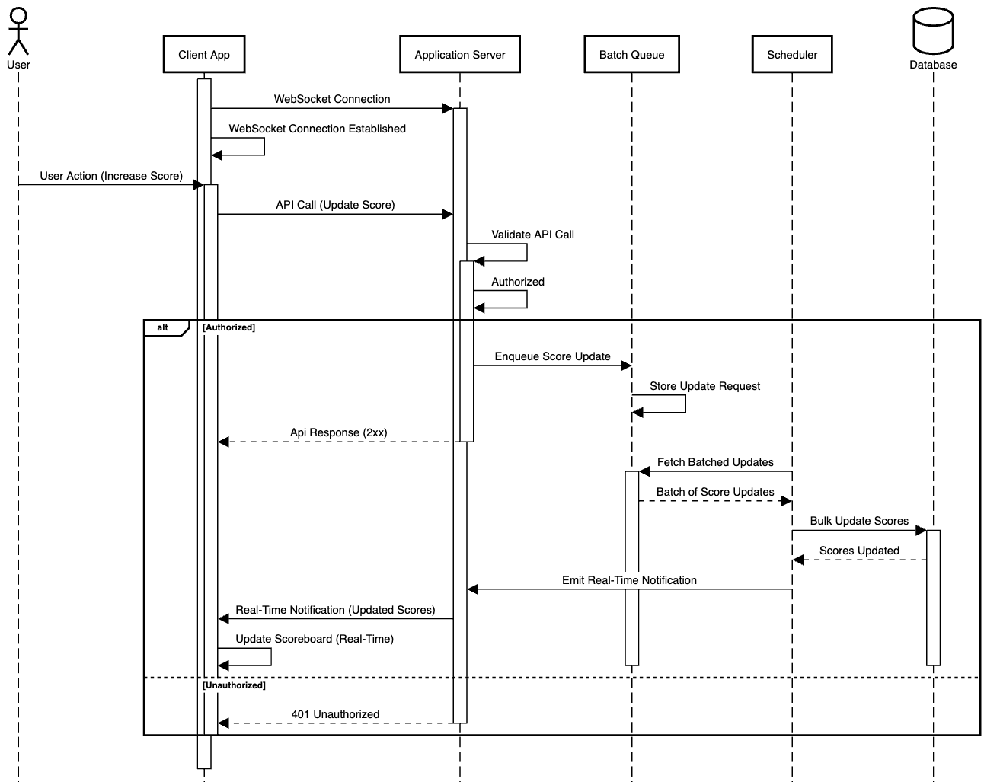

# Scoreboard API Module Specification (with Batch Processing)

---

## Overview

This document outlines the specifications for the **Scoreboard API module** responsible for managing live updates of user scores on a website. It handles user actions that increase scores while preventing unauthorized score manipulations. This version incorporates **batch processing** for efficient score updates and improved performance.

---

## Flow of Execution

The updated flow introduces **batch processing** for score updates, ensuring efficient database interactions and real-time scoreboard updates.

### 1. User Action
- User completes an action that triggers a score increment.

### 2. API Call
- The client application sends an API call to the application server with the user's identifier and action details.

### 3. Request Validation
- The application server validates:
  - **JWT Token** for user authentication.
  - **Action Validity** to ensure the action is legitimate.
  - **Replay Attack Prevention** to prevent duplicate actions.

### 4. Batch Queue
- The validated score update request is **queued** in a `Batch Queue`.

### 5. Batch Processing
- A **Scheduler** periodically processes the batched requests:
  - Retrieves all pending score updates.
  - Performs a **bulk update** to the database.

### 6. Real-Time Notification
- After the bulk update, a **WebSocket** event is emitted to update the scoreboard in real-time.

### 7. Live Scoreboard Update
- The client app listens for WebSocket events and updates the scoreboard accordingly.

---

## Diagram: Flow of Execution

### Sequence Diagram

---

## Functional Requirements

### 1. Live Scoreboard Updates

- **Real-Time Updates**: The module should provide real-time updates of the top 10 user scores on the website using WebSocket events.
- **Batch Processing**: Group multiple score updates into a batch to perform a single bulk update, reducing database load.

---

### 2. User Actions

- Accepts user actions that trigger a score increment.
- The specific nature of the action is not a concern for this module.

---

### 3. Secure Score Update API Call

- **Endpoint**: `/api/score/increment`
- **Method**: `POST`
- **Request Payload**:
    ```json
    {
      "userId": "string",
      "actionId": "string"
    }
    ```
- **Response**:
  - **200 OK**: Score update request enqueued successfully.
  - **401 Unauthorized**: Unauthorized user or invalid JWT.
  - **400 Bad Request**: Invalid request payload or action.
  - **429 Too Many Requests**: Rate limit exceeded.
  - **500 Internal Server Error**: Server error.

---

### 4. Retrieve Top Scores

- **Endpoint**: `/api/score/top`
- **Method**: `GET`
- **Response**:
    ```json
    {
      "status": "success",
      "data": [
        {
          "userId": "string",
          "score": "number"
        }
      ]
    }
    ```

---

## Batch Processing Details

### 1. Batch Queue

- Temporarily stores multiple score update requests.
- Queued requests are processed together in a batch to minimize database interactions.

### 2. Scheduler

- Periodically retrieves batched updates (e.g., every 1 second).
- Performs a **bulk update** to the database.

### 3. Real-Time Notification

- After a successful batch update, a **WebSocket event** is emitted.
- All connected clients receive the event and update the scoreboard in real-time.

---

## Security Considerations

### 1. Authentication & Authorization

- Use **JWT** for user authentication.
- Verify user permissions before enqueuing score updates.

### 2. Replay Attack Prevention

- Store and validate `actionId` in the database to prevent duplicate actions.
- Ensure each action is counted only once per user.

### 3. Rate Limiting

- Implement rate limiting to prevent abuse.
- Return **429 Too Many Requests** for excessive requests.

### 4. Data Validation

- Validate all incoming requests using middleware (e.g., `express-validator`).
- Ensure that only valid `userId` and `actionId` are processed.

---

## Database Schema

```sql
CREATE TABLE users (
  id UUID PRIMARY KEY,
  username VARCHAR(50) NOT NULL,
  score INT DEFAULT 0
);

CREATE TABLE actions (
  id UUID PRIMARY KEY,
  action_name VARCHAR(50) NOT NULL,
  score_value INT NOT NULL
);

CREATE TABLE user_actions (
  id UUID PRIMARY KEY,
  user_id UUID REFERENCES users(id),
  action_id UUID REFERENCES actions(id),
  timestamp TIMESTAMP DEFAULT CURRENT_TIMESTAMP,
  UNIQUE(user_id, action_id)
);
```
